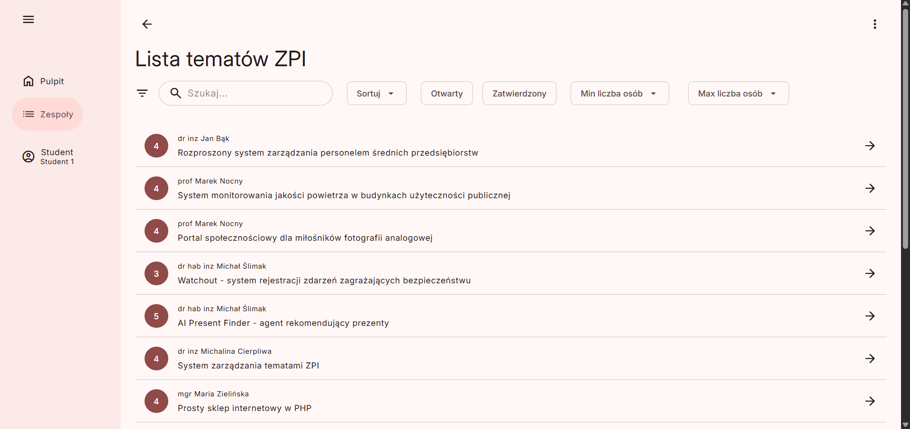
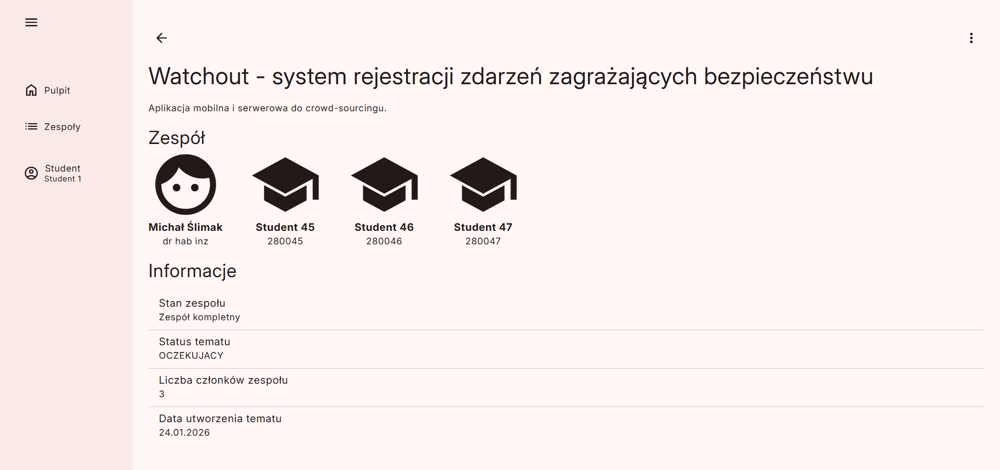
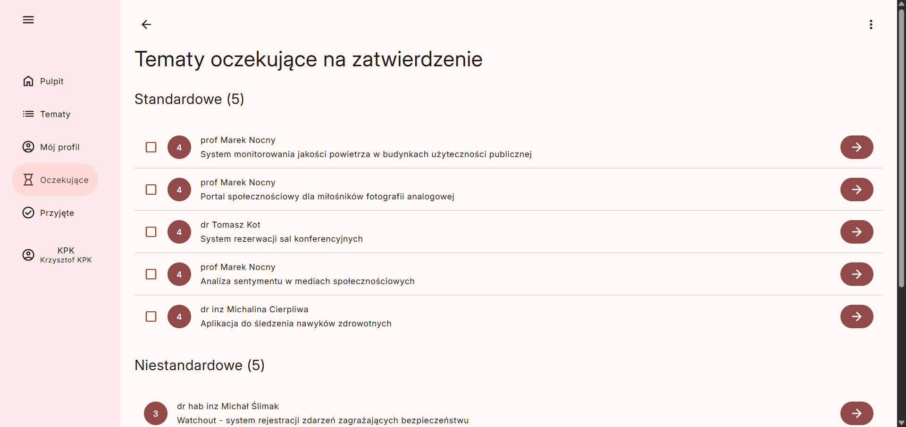
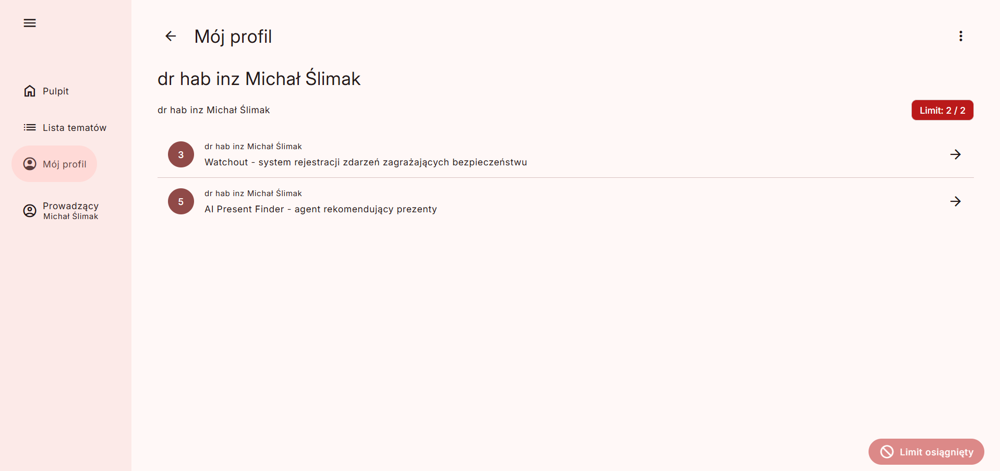
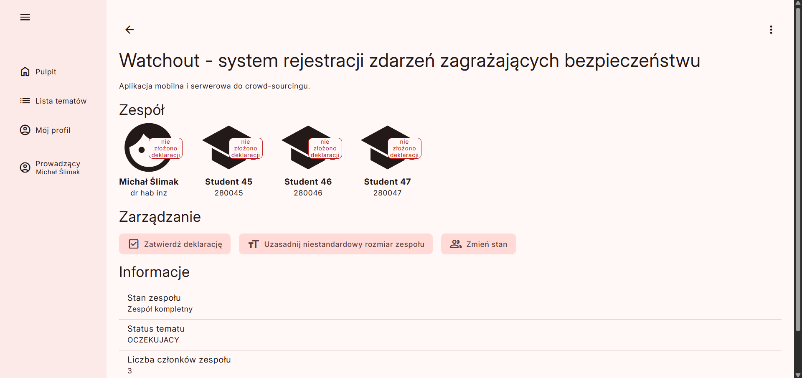
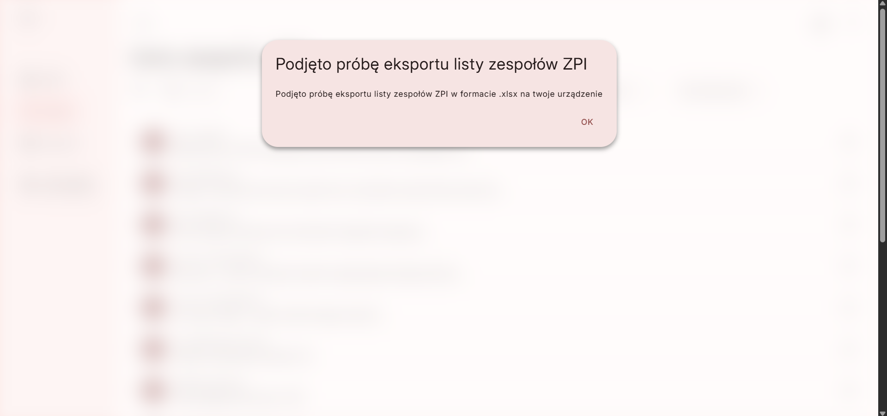

# Engineering Projects Manager 🎓

Engineering Projects Manager is a web-based application designed as a conceptual implementation of selected parts of the process of submitting, managing, and approving engineering project topics and student teams at Wrocław University of Science and Technology.

The project focuses on a defined subset of the overall system and implements six use cases that reflect real academic roles and responsibilities involved in organizing team-based engineering projects.

The application models interactions between students, academic staff, and committee members, providing a structured representation of the decision-making and approval workflow.

---

## 📌 Implemented Use Cases

The application implements the following six use cases:

- **Topic Browsing / Student**  
- **Topic Handling / KPK Member**  
- **Justification Handling / KPK Member**  
- **Declaration Approval / Supervisor, Student**
- **Topic Management / Supervisor**  
- **Team List Export / Course Coordinator**

---

## 🛠 **Technologies Used**

- Python
- Flask
- SQLite
- React
- TypeScript
- BeerCSS

---

## 🤝 **Team**

- [Franciszek](https://github.com/fdobrzynski)
- [Kacper](https://github.com/Kapixar)
- [Stanisław](https://github.com/stanislawkaczmarek1)

---

## 📸 **Screenshots**

---
